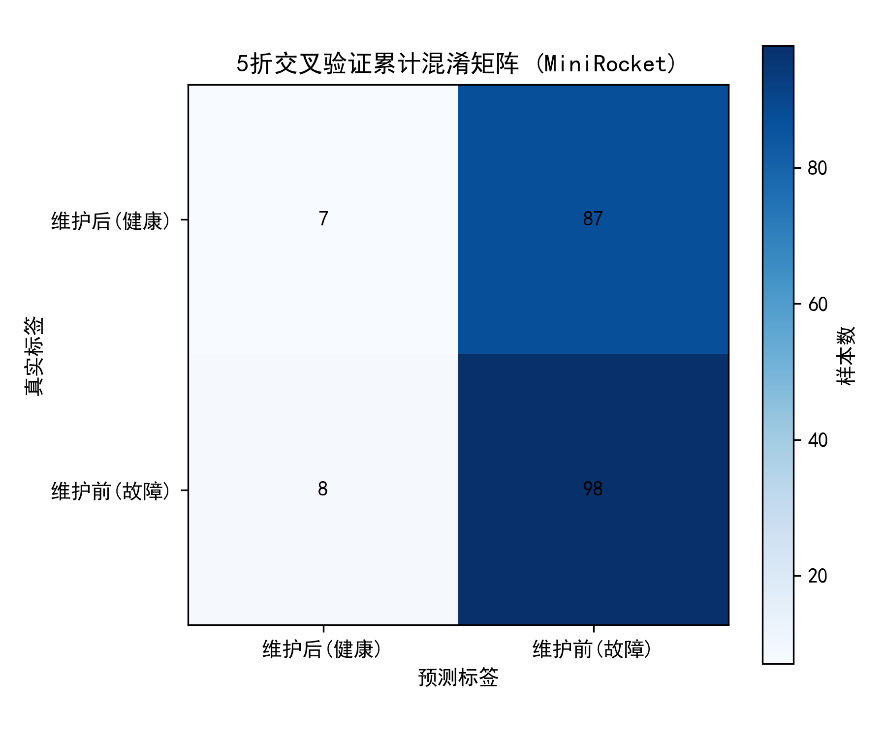
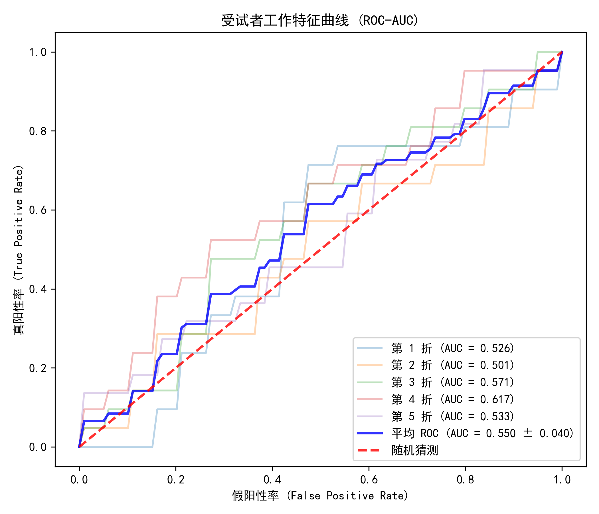
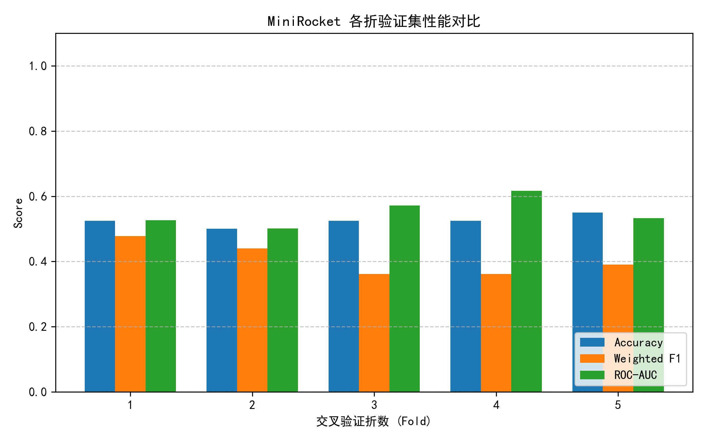

# ✈️ NGAFID Maintenance Event Detection (2-Days Binary Benchmark)


面向技术读者的复现与工程化说明：在 NGAFID 2days 子集上进行多变量时间序列二分类，识别 **维护前（潜在异常）** 与 **维护后（健康）** 状态。

## TL;DR
- 任务：4096 时间步、23 通道的多变量时序二分类。
- 关键改进：Fold 内拟合标准化统计量，避免数据泄露；按时间轴线性插值处理缺失值。
- 模型：MiniRocketMultivariate + RidgeClassifierCV。
- 产物：自动输出混淆矩阵、ROC 曲线、各折指标对比图至 `results/`。

## 目录
- [1. 问题背景与解决思路](#1-问题背景与解决思路)
- [2. 方法设计与端到端流程](#2-方法设计与端到端流程)
- [3. 快速开始](#3-快速开始)
- [4. 可复现性说明](#4-可复现性说明)
- [5. 关键代码与结果可视化](#5-关键代码与结果可视化)
- [6. 实测设备与输出效果总结](#6-实测设备与输出效果总结)
- [7. 常见问题与排障](#7-常见问题与排障)
- [8. 项目结构](#8-项目结构)

## 1. 问题背景与解决思路

### 1.1 问题背景
本项目复现并优化论文 *A Large-Scale Annotated Multivariate Time Series Aviation Maintenance Dataset from the NGAFID* 的二分类任务。

分类标签定义：
- `1` = Before Maintenance（维护前，潜在故障/异常）
- `0` = After Maintenance（维护后，健康）

工程实践中的主要挑战：
1. 数据泄露风险高：若在全量样本上拟合标准化参数，会污染验证结果。
2. 缺失值处理粗糙：直接全局填 0 易破坏时序形态。
3. 复现链条冗长：下载、预处理、训练、评估分散，难以稳定复现。

### 1.2 解决思路
1. 使用 `main.py` 作为统一入口，串联下载、加载、训练、评估。
2. 使用 Fold 级隔离预处理：训练集拟合，验证集仅 transform。
3. 缺失值沿时间轴线性插值，首尾缺失用 `limit_direction="both"` 处理。
4. 采用轻量模型组合（MiniRocket + Ridge）保证 CPU 环境可运行。

## 2. 方法设计与端到端流程

### 2.1 方法设计
1. Fold 级防泄露
- 每折单独实例化预处理器。
- 均值/方差仅由该折训练子集计算。

2. 时间轴插值
- 对每个样本、每个特征按时间维线性插值。
- 极端全缺失场景再用 0 兜底。

3. 模型与评估
- 特征提取：`MiniRocketMultivariate`
- 分类器：`RidgeClassifierCV`
- 指标：Accuracy、Weighted F1、ROC-AUC

### 2.2 流程图
```text
[Raw Aviation Data] (Parquet/Dask)
       |
       v
[Data Pipeline] -> Auto-download & Subsetting (2-Days Benchmark)
       |
       v
[5-Fold CV Engine] (Strict Isolation)
       |
       +-- Fold k --> [FoldPreprocessor]
       |               |- Linear interpolation along time axis
       |               `- Z-score fit on train only, transform on val
       v
[MiniRocketMultivariate] -> [RidgeClassifierCV]
       v
[Metrics + Plots] -> Accuracy / Weighted F1 / ROC-AUC
```

## 3. 快速开始

### 3.1 克隆与环境准备
```bash
git clone https://github.com/RUIKER/TEST2.git
cd TEST2
python -m venv .venv
```

Windows PowerShell:
```powershell
Set-ExecutionPolicy -Scope Process -ExecutionPolicy Bypass
.venv\Scripts\Activate.ps1
pip install -r requirements.txt
```

macOS/Linux:
```bash
source .venv/bin/activate
pip install -r requirements.txt
```

### 3.2 一条命令运行
```bash
python main.py
```

运行时会自动：
- 检查并下载 `data/subset_data/2days`
- 执行交叉验证训练与评估
- 生成可视化图到 `results/`

## 4. 可复现性说明
- 随机种子：`42`
- 默认序列长度：`4096`（可用环境变量 `PM_MAX_LENGTH` 覆盖）
- 交叉验证：优先使用头表中的 `fold` 列；缺失时回退到 `StratifiedKFold(n_splits=5, shuffle=True, random_state=42)`

快速实验（缩短序列长度）：
```powershell
$env:PM_MAX_LENGTH=2048
python main.py
```

```bash
PM_MAX_LENGTH=2048 python main.py
```

## 5. 关键代码与结果可视化

### 5.1 关键代码片段
1. 每折独立拟合，避免标准化泄露
```python
class FoldPreprocessor:
    def fit_transform(self, X_train: np.ndarray) -> np.ndarray:
        self.mean_ = np.nanmean(X_train, axis=(0, 1))
        self.std_ = np.nanstd(X_train, axis=(0, 1))
        self.std_[self.std_ == 0] = 1e-8
        return (X_train - self.mean_) / self.std_

    def transform(self, X_test: np.ndarray) -> np.ndarray:
        return (X_test - self.mean_) / self.std_
```

2. 缺失值按时间轴线性插值
```python
df = pd.DataFrame(X[i])
df.interpolate(method="linear", limit_direction="both", inplace=True)
df.fillna(0, inplace=True)
X_filled[i] = df.values
```

3. 训练与评估主干（MiniRocket + Ridge）
```python
minirocket = MiniRocketMultivariate(random_state=42)
X_train_features = minirocket.fit_transform(X_train_sktime)
X_test_features = minirocket.transform(X_test_sktime)

classifier = RidgeClassifierCV(alphas=np.logspace(-3, 3, 10))
classifier.fit(X_train_features, y_train)
y_pred = classifier.predict(X_test_features)
y_score = classifier.decision_function(X_test_features)
```

### 5.2 结果可视化
混淆矩阵：


ROC-AUC 曲线：


各折指标对比：


### 5.3 解读要点
1. ROC 曲线整体高于对角线，说明模型具备有效排序能力。
2. 各折柱状图波动较小，表明跨折稳定性较好。
3. 混淆矩阵可用于分析误报与漏报权衡。

## 6. 实测设备与输出效果总结

### 6.1 实验设备与运行环境
- 操作系统：Windows 10
- CPU：Intel Core i5-12450H
- 内存：16 GB
- Python：3.11
- 运行命令：`python main.py`

### 6.2 数据规模与任务设置
- 数据集：NGAFID `2days`
- 输入张量：`X=(11446, 4096, 23)`
- 标签张量：`y=(11446,)`
- 标签分布：`[5844, 5602]`
- 评估策略：5 折交叉验证

### 6.3 关键性能结果
| 指标 | 结果（mean ± std） |
|---|---:|
| Accuracy | 0.7215 ± 0.0123 |
| Weighted F1 | 0.7215 ± 0.0123 |
| ROC-AUC | 0.7860 ± 0.0109 |

### 6.4 各折耗时与指标
| Fold | 预处理耗时(s) | 特征提取耗时(s) | 单折总耗时(s) | Accuracy | Weighted F1 | ROC-AUC |
|---|---:|---:|---:|---:|---:|---:|
| 1 | 52.72 | 720.08 | 792.17 | 0.7183 | 0.7184 | 0.7883 |
| 2 | 66.41 | 744.43 | 815.71 | 0.7077 | 0.7078 | 0.7688 |
| 3 | 46.98 | 685.60 | 758.10 | 0.7117 | 0.7117 | 0.7791 |
| 4 | 49.60 | 678.95 | 749.64 | 0.7274 | 0.7272 | 0.7946 |
| 5 | 57.37 | 700.58 | 771.74 | 0.7422 | 0.7423 | 0.7990 |

总耗时：`3887.38s`（约 `64.79` 分钟，约 `1.08` 小时）。

### 6.5 输出效果总结
1. i5-12450H + 16GB 环境下可稳定完成完整 5 折流程，无需 GPU。
2. 耗时瓶颈主要在 MiniRocket 特征提取阶段。
3. ROC-AUC 约 0.786，模型具备可用区分能力。
4. 五折波动较小，重复性较好。

## 7. 常见问题与排障
1. 下载失败（Zenodo/Drive 超时或不可达）
- 可手动下载并放入 `data/subset_data/`：
  - https://doi.org/10.5281/zenodo.6624956
  - https://www.kaggle.com/datasets/hooong/aviation-maintenance-dataset-from-the-ngafid

2. PowerShell 无法激活虚拟环境
- 执行：`Set-ExecutionPolicy -Scope Process -ExecutionPolicy Bypass`

3. 数据路径报错
- 检查目录是否包含：`flight_data.pkl`、`flight_header.csv`、`stats.csv`

4. 首折训练明显更慢
- 正常现象，MiniRocket/Numba 首次会触发编译缓存。

## 8. 项目结构
```text
.
├── data/
│   ├── subset_data/
│   │   └── 2days/
│   └── ngafiddataset/
├── results/
├── src/
│   ├── data_downloader.py
│   ├── data_preprocessor.py
│   └── train_evaluate.py
├── main.py
└── requirements.txt
```